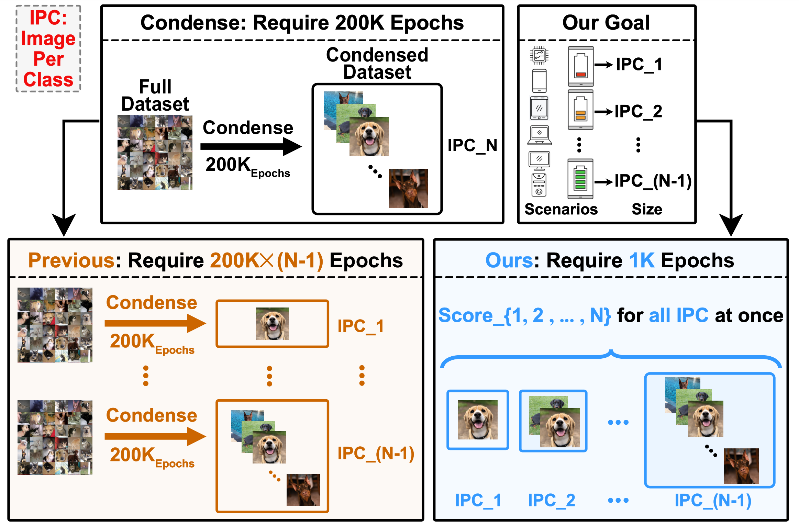

# You Only Condense Once (YOCO)
[[`Paper`](https://arxiv.org/abs/2310.14019)] [[`BibTeX`](#citation)]

<!--  -->


On top of one condensed dataset, YOCO produces smaller condensed datasets with two embarrassingly simple dataset pruning rules, **Low LBPE Score** and **Balanced Construction**. YOCO offers two key advantages: 1) it can flexibly resize the dataset to fit varying computational constraints, and 2) it eliminates the need for extra condensation processes, which can be computationally prohibitive. 

## Getting Started
First, download our repo:
```
https://github.com/he-y/you-only-condense-once.git
cd you-only-condense-once
```

Second, create conda environment:
The code has been tested with `Pytorch 1.11.0` with `Python 3.9.15`.
```
# create conda environment
conda create -n yoco python=3.9
conda activate yoco
```

Third, install the required dependencies:
```
pip install -r requirements.txt
```

Our code is mainly based on two repositories:
- [Efficient-Dataset-Condensation](https://github.com/snu-mllab/Efficient-Dataset-Condensation)
- [Coverage-centric-coreset-selection](https://github.com/haizhongzheng/Coverage-centric-coreset-selection)

Main Files of the Repo
- `get_training_dynamics.py` trains a model and track the training dynamics based on condensed datasets.
- `generate_importance_score.py` generate importance score according to the stored training dynamic files.
- `utils/img_loader.py` loads condensed datasets with target IPC according to the pre-computed importance scores.

## Module 1: Condensed Dataset Preparation ([Google Drive File](https://drive.google.com/drive/folders/1_LJ5mhUQckh4BrYpfFKLeHMWk5HN0r0i?usp=sharing))

The condensed datasets used in our experiments can be downloaded from [google drive](https://drive.google.com/drive/folders/1_LJ5mhUQckh4BrYpfFKLeHMWk5HN0r0i?usp=sharing). The downloaded datasets should follow below file structure:
> ```
> YOCO
> - raid
>   - condensed_img
>     - dream
>     - idc
>     - ...
> ```

`condense_key` in below table  denotes condensed datasets obtained by which method are evaluated.  Our experiment results are mainly tested on [IDC](https://github.com/snu-mllab/Efficient-Dataset-Condensation), so default setting is `condense_key = idc`.


| `condense_key` | Description                                                                                                                                 | 
| -------------- | ------------------------------------------------------------------------------------------------------------------------------------------- | 
| `idc`          | [Dataset Condensation via Efficient Synthetic-Data Parameterization (IDC)](https://github.com/snu-mllab/Efficient-Dataset-Condensation)     | 
| `dream`        | [Efficient Dataset Distillation by Representative Matching (DREAM)](https://github.com/lyq312318224/DREAM)                                  | 
| `mtt`          | [Dataset Distillation by Matching Training Trajectories (MTT)](https://github.com/GeorgeCazenavette/mtt-distillation)                       | 
| `dsa`          | [Dataset Condensation with Differentiable Siamese Augmentation (DSA)](https://github.com/VICO-UoE/DatasetCondensation)                      | 
| `kip`          | [Dataset Distillation with Infinitely Wide Convolutional Networks (KIP)](https://github.com/google-research/google-research/tree/master/kip) | 


If you want to condense by yourself, run:
```bash
python condense.py --reproduce_condense  -d [dataset] -f [factor] --ipc [images per class]
```


<!-- Condensed datasets of other datasets can be obtained by following below repo:
- [IDC (Dataset Condensation via Efficient Synthetic-Data Parameterization)](https://github.com/snu-mllab/Efficient-Dataset-Condensation)
- [DREAM (Efficient Dataset Distillation by Representative Matching)](https://github.com/lyq312318224/DREAM)
- [MTT (Dataset Distillation by Matching Training Trajectories)](https://github.com/GeorgeCazenavette/mtt-distillation)
- [DSA (Dataset Condensation with Differentiable Siamese Augmentation)](https://github.com/VICO-UoE/DatasetCondensation)
- [KIP (Dataset Distillation with Infinitely Wide Convolutional Networks)](https://github.com/google-research/google-research/tree/master/kip) -->

---

## Module 2: Pruning the Condensed Datasets via Three Steps ([Google Drive File](https://drive.google.com/drive/folders/1rK88VyLtwQBpf16viqG0Xcp9UTYxW0n0?usp=sharing))


Step 1: Generate the training dyanmics from the condensed dataset (**or** you can directly downloaded our generated training dynamics [here](https://drive.google.com/drive/folders/1rK88VyLtwQBpf16viqG0Xcp9UTYxW0n0?usp=sharing)):
```bash
python get_training_dynamics.py --dataset [dataset] --ipc [IPCF] --condense_key [condensation method]
```

Step 2: Generate the score file for each image according to the training dynamic:
```bash
python generate_importance_score.py --dataset [dataset] --ipc [IPCF] --condense_key [condensation method]
```

Step 3: Evaluate the performance using different dataset pruning metrics
```bash
python test.py -d [dataset] --ipc [IPCF] --slct_ipc [IPCT] --pruning_key [pruning method] --condense_key [condensation method]
```


`pruning_key` denotes different dataset pruning methods including:
| `pruning_key`        | Description                                                                                                        | Prefer hard/easy? | Balanced? |
| ---------------------| ------------------------------------------------------------------------------------------------------------------ | :---------------: | :-------: |
| `random`             | Random Selection                                                                                                   | N/A               | no        |
| `ssp`                | [Self-Supervised Prototype](https://openreview.net/forum?id=UmvSlP-PyV)                                            | hard              | no        |
| `entropy`            | [Entropy](https://openreview.net/forum?id=HJg2b0VYDr)                                                              | hard              | no        |
| `accumulated_margin` | [Area Under the Margin](https://proceedings.neurips.cc/paper/2020/file/c6102b3727b2a7d8b1bb6981147081ef-Paper.pdf) | hard              | no        |
| `forgetting`         | [Forgetting score](https://openreview.net/forum?id=B6vWWXJISg5)                                                    | hard              | no        |
| `el2n`               | [EL2N score](https://openreview.net/forum?id=Uj7pF-D-YvT)                                                          | hard              | no        |
| `ccs`                | [Coverage-centric Coreset Selection](https://openreview.net/forum?id=QwKvL6wC8Yi)                                  | easy              | no        |
| `yoco`               | Our method                                                                                                         | easy              | yes       |

- `Prefer hard/easy?` means the method prefer hard samples or easy samples.
- `Balanced` means the method consider balanced or not.
- `ccs` prunes hard images identified by `el2n` score (in our implementation).

To alter the components for each metric, we can append following suffixes after `pruning_key`:
| suffix  | explanation   |
| - | -----------   |
| `_easy` / `_hard` | Whether to use easy / hard samples |
| `_balance` / `_imbalance` | Whether to have balance / imbalance class distribution |

For example, default `forgetting` metric is equivalent to `forgetting_hard_imbalance`, prefer hard and not balanced.
- Changes to `forgetting_easy` to prefer easy.
- Changes to `forgetting_balance` to construct balanced samples.
- Changes to `forgetting_easy_balance` or `forgetting_balance_easy` to prefer easy + balanced. 


## Table reproducing
For the ease of reproducing experiment results, we provide the `bash` shell scripts for each table. The scripts can be found in `scripts\table[x].sh`. The training dynamics and scores used in our experiments can be downloaded from [google drive](https://drive.google.com/drive/folders/1rK88VyLtwQBpf16viqG0Xcp9UTYxW0n0?usp=sharing). Note: the training dynamics contains large files (e.g., `idc/cifar100` is ~6GB).

The downloaded files should follow below file structure:
> ```
> YOCO
> - raid
>   - reproduce_*
>       - dynamics_and_scores
>         - idc
>         - dream
>         - ...
>   - condensed_img (download from Module 1)
>     - idc
>     - dream
>     - ...
> ```
> 
> - Our experiment results are averaged over three independent training dynamics, which corresponds to folder `reproduce_1`, `reproduce_2`, and `reproduce_3`.


# Citation
```txt
@inproceedings{
    heyoco2023,
    title={You Only Condense Once: Two Rules for Pruning Condensed Datasets},
    author={Yang He and Lingao Xiao and Joey Tianyi Zhou},
    booktitle={Thirty-seventh Conference on Neural Information Processing Systems},
    year={2023},
    url={https://openreview.net/forum?id=AlTyimRsLf}
}
```
